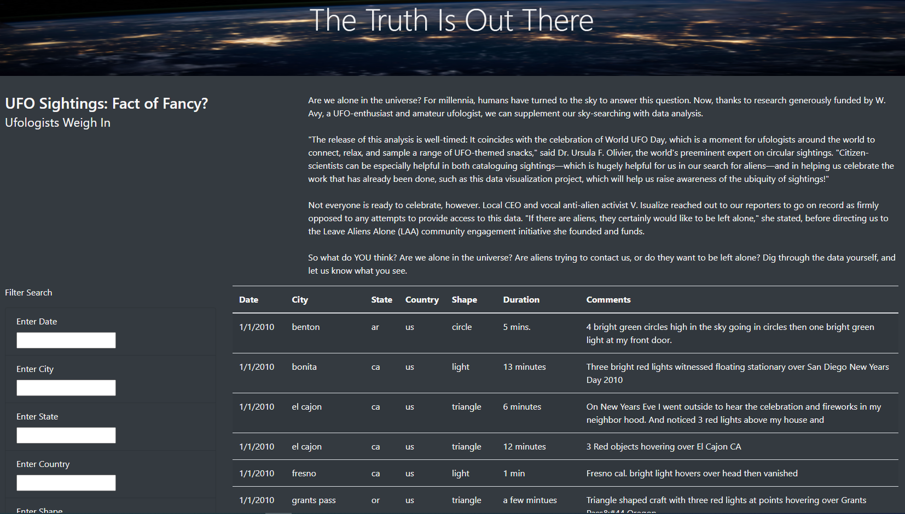

# UFOs

## Project Overview
The purpose of this project was to update a website that was created to display data on UFO sightings in a dynamic table format to then allow a user to filter that data based on any or all of the following criteria: date, city, state, country, and shape of the sighting.

##  Resources
The following resources were used to complete this analysis:
- Input Data Sources:  data.js file containing UFO sighting information
- Software:  VSCode (using both Javascript and HTML code), Google Chrome

## Project Results
### Website Overview

Upon opening the website, a table containing data of UFO sightings is displayed, including information such as the date, city, state, and country in which the sighting was documented as having occured, as well as descriptions of the event including type/shape of sighting and duration as well as any related comments.  This information is pulled from a javascript datafile.  As more data is added to the datafile, it can also then be pulled into this website.  Following is a screenshot of the website:

### Filter Functionality Overview

There is the ability to filter the table data for those wishing to look at specific events.  The data can be filtered by date, city, state, country, and shape of sighting or any combination of the above.  Updating the table data based on the filter criteria is triggered by a value being entered in any of the filter/search text boxes and either hitting enter on the keyboard, or tabbing to the next cell.  Below are some examples:

1. Entering just one filter will display the data that meets only that one filter criteria.  In this example, all sightings with a date of 1/2/2010 are displayed.

2. Entering multiple filters will show data that meets all of the filter criteria together.  In this example, there was only one sighting that met all of the entered criteria.

3. Clearing all filters results in all of the original data being displayed.

## Summary

### Recommendations for Further Development
Having the ability to filter data based multiple criteria is a significant improvement in functionality over the original project.  However, there are still some drawbacks to this design and further functionality that can be added to address those.  One such drawback is, that even with the multiple options for filtering the data, the input boxes accept just free-form text.  In order to know what data is acceptable to be entered so that results are returned, the user will need to manually look through the table data.  Doing this will give them what data is actually contained within the table and can be filtered on, and how that data is formatted.

To address the situation above as well as well as address other functionality that can be improved upon, following are some recommendations that could be considered for future releases: 

1. Updating the search boxes to be dropdowns that list the possible choices for each of the criteria
    
    - For example, the date search box would only list the dates actually contained within the dataset, the city search box would only list the cities with data contained within the dataset, etc.  This would save the user from having to manually scroll through the dataset to determine which search criteria is valid, and how it needs to be formatted.  It would also help alleviate issues with unexpected results due to typing mistakes or misspellings.

1.  Adding a button that would allow the user to reset all of the results
    
    - The results can be reset (in order to display all of the original data) by manually clearing out the search boxes.  A reset button would make that an easier, more streamlined task.
  

